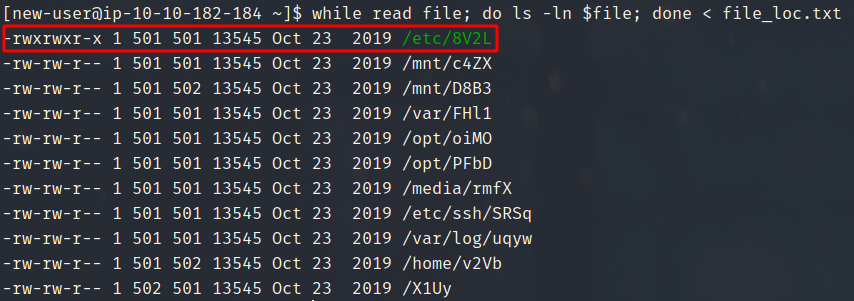

# Tryhackme: [Ninja Skills](https://tryhackme.com/room/ninjaskills)

This is a basic linux room which tests your bash skills. Lets start by sshing into the machine.
`ssh new-user@10.10.118.172`

If we list out our home directory we just find an empty folder named `files`. In the question we are given a bunch of file names which are placed somewhere in the file system.
So first let's start by locating these files.

## Locating filenames in the file system

- Lets store all the file names in a file. I have used vim to write all file names in a file called `files.txt`
  
- Now lets use `find` command to get the exact path of these files and store them in another file
  `for i in $(cat files.txt); do find / -name $i >> file_loc.txt 2> /dev/null; done`
  

> Command Breakdown:
> We start with a bash for loop which loops over all the names in `files.txt` and stores those names in variable `i`. So for each name in `files.txt` we run a find command to get the exact location of that file.
> `find`: linux command to find files (and do much more)
> `/` : start looking in root(/) and its subdirctories
> `name`: find the file with the name $i

Along with redirecting any error while reading the file we are also redirecting the standard output `>>` to `file_loc.txt`

## Question 1

We have to find the files which are owned by `best-group` group
`while read filename; do ls -l $filename | grep best-group; done < file_loc.txt`

> Command Breakdown
> We run a while loop where we are reading from standard input (Linux `read` command reads in from standard input), and we are providing the `file_loc.txt` as an input to the read command `< file_loc.txt` (`<` means standard input)
> After that we are performing a `ls -l` on each of those files and grepping for the group "best-group"
> Ans: D8B3 v2Vb

## Question 2

Now we have find the file which contains an ip address
`while read file; do grep -HP "(\d+\.){3}\d+" $file ; done < file_l.txt`

> Command Breakdown
> Again we make use of while loop for looping over files and we use regex with grep to grab the file containing an IP address
> grep: Linux grep command to grab a string matching a certain expression
> `-H`: Give the file name for the matches found
> `-P`: User Perl regex( You can also use -e for normal regex )
> `Regexp`: (\d+\\.) matches any string with any amount of numbers followed by a dot

Ans: oiMO

## Question 3

We have to find the file with SHA1 hash of `9d54da7584015647ba052173b84d45e8007eba94`

`while read file; do sha1sum $file | grep 9d5; done < file_l.txt`

> Command Breakdown
> We again make use of while loop and then in the body of while loop we evaluate the sha1 hash with the linux command `sha1sum filename` and we grep for first three letter of hash with the one given in the question

Ans: c4ZX

## Question 4

We have to find the file that contains 230 lines. We will be making use of `wc` (word count) linux command
`while read file; do wc -l $file; done < file_l.txt`

If we look at the output all of the files have 209 lines and the file `bny0` is not present.
Ans: bny0

## Question 5

Now we have to find the file which is owned by the user with UID 502. We can find the user having UID 502 by looking at /etc/passwd. And you will find out the name of the user is `newer-user`
`while read file; do echo $file; stat -c '%U' $file | grep newer-user; done < file_l.txt`

We can see that the file `X1Uy` is owned by `new-user`
Ans: X1Uy

## Question 6

We have to find the file which is executable by everyone
`while read file; do ls -ln $file; done < file_l.txt`

Again we use while loop to traverse through all the files and the execute `ls -ln` to list the permissions for each file and we see `/etc/8V2L` has executable permissions for all users
Ans: 8V2L

---

At the end I would like to thank you all for making it this far, and since this was my first Tryhackme writeup, it would be great if you can give me feedback on how could I make my writeups better in the future. You can find me at tiwtter [here](https://twitter.com/smash8tap)
